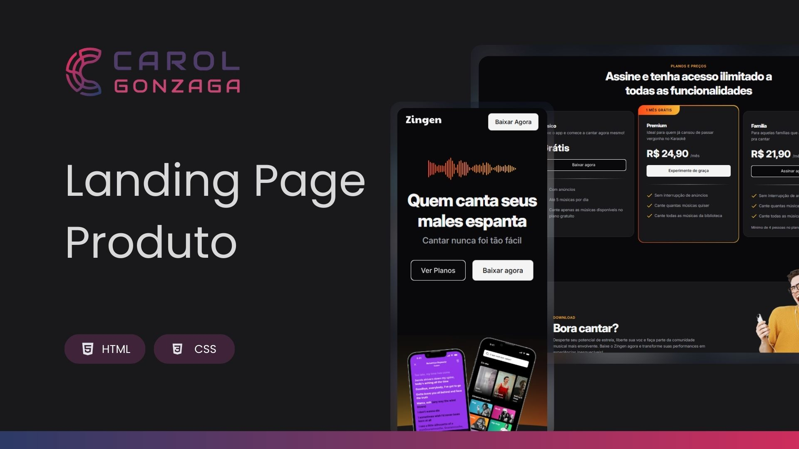

  

 

Projeto de uma landing page de produto - Mobile First.

  <a href="#-tecnologias">Tecnologia</a>&nbsp;&nbsp;&nbsp;|&nbsp;&nbsp;&nbsp;<a href="">Acesse o Projeto</a>

 
 

  

 
 

## 🚀 Tecnologias

Esse projeto foi desenvolvido com as seguintes tecnologias:

- HTML5
- CSS3

 
 

## 🎯 Objetivo

O objetivo desse projeto é consolidar conhecimentos fundamentais sobre responsividade de páginas utilizando conceitos de Mobile First.
